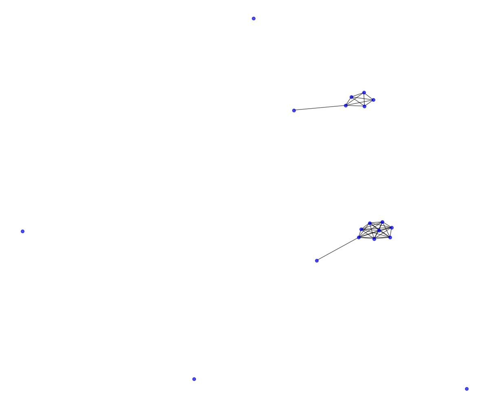
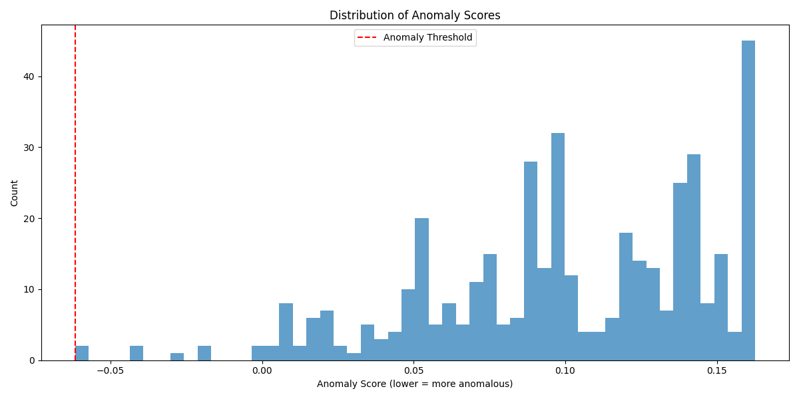
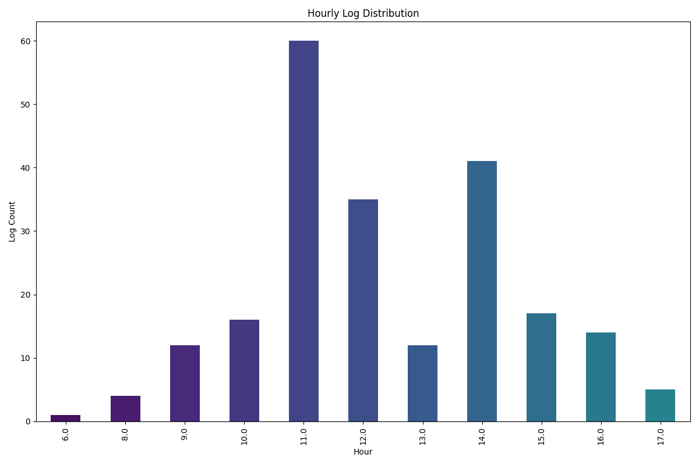

# 🛡️ Olay İlişkilerini Kullanarak Siber Saldırı Tahmini ve Tespiti Aracı

## 📌 Proje Özeti
Bu bitirme projesi, uç noktalara (endpoint) kurulan ajanlardan toplanan Windows ve Linux olay günlüklerini (event logs) analiz ederek, gelişmiş siber tehditleri tespit eden yapay zeka destekli bir güvenlik aracıdır. Geleneksel kural tabanlı sistemlerin aksine, bu sistem makine öğrenmesi algoritmaları ve **olay korelasyonu (event correlation)** teknikleri kullanarak normal log akışındaki anomalileri tespit eder.

## 🧠 Geliştirilen Sistemin Yetenekleri

*   **Veri Ön İşleme (Data Preprocessing):** Saniyede yüzlerce satır akan karmaşık log verilerinin (IP, MAC, information, severity vb.) temizlenmesi ve makine öğrenmesi modellerine uygun vektörlere dönüştürülmesi.
*   **Olay Korelasyonu (Event Correlation):** Farklı zamanlarda ve farklı cihazlarda (node) meydana gelen görünürde bağımsız logların birleştirilerek anlamlı bir saldırı zinciri (Ör: Brute force sonrası yetki yükseltme) olarak tespit edilmesi.
*   **Anomali Tespiti (Machine Learning):** Normal sistem davranışının öğrenilmesi ve bu davranıştan sapan olayların (malware aktivitesi, olağandışı ağ trafiği) işaretlenmesi.
*   **Gelişmiş Görselleştirme:** Ağ bağlantı grafikleri, tehdit ısı haritaları ve zaman çizelgeleri ile güvenlik uzmanları için okunabilir raporların otomatik üretilmesi.

## 📊 İstatistikler ve Çıktılar

Sistemin gerçek veriler üzerinde çalıştırılmasıyla elde edilen bazı analiz çıktıları aşağıdadır:

### 1. Olay Korelasyon Ağı (Event Correlation)
Farklı log türleri arasındaki ilişkilerin ve saldırı vektörlerinin ağ analizi:

### 2. Anomali Dağılımı ve Zaman Çizelgesi
Sistemde tespit edilen normal olaylar ile anomali olarak işaretlenen kritik olayların zamansal dağılımı:

### 3. İnteraktif Grafikler
Proje kapsamında güvenlik analistlerinin detaylı inceleme yapabilmesi için HTML formatında interaktif grafikler üretilmiştir. Bu dosyaları indirip tarayıcınızda açarak inceleyebilirsiniz:
*   🔗 [`node_network_graph.html`](Gorsellestirmeler/node_network_graph_blurred.png) - Ağ düğümleri arasındaki ilişkiler.
*   🔗 [`threat_heatmap.html`](Gorsellestirmeler/threat_heatmap.html) - Tehditlerin yoğunluk haritası.
*   🔗 [`anomaly_timeline.html`](Gorsellestirmeler/anomaly_detection_timeline.png) - Zaman bazlı anomali takibi.

> ⚠️ **Gizlilik Notu:** Bu proje, gerçek sistemlerden toplanan hassas siber güvenlik logları (EFEM ajanları) kullanılarak geliştirildiği için, veri gizliliği politikaları ve etik kurallar gereği **kaynak kodlar ve ham veri setleri (CSV/JSON) paylaşılmamıştır.** Bu depo, projenin mimarisini, analiz metodolojisini ve elde edilen istatistiksel sonuçları/raporları sergilemek amacıyla bir "Proje Vitrini" olarak hazırlanmıştır.

## 📄 Proje Raporları ve Sunumlar

Projenin tüm akademik ve teknik detayları, kullanılan YZ modellerinin başarı metrikleri (Precision, Recall, F1-Score) ve sistemin teorik altyapısı aşağıdaki dokümanlarda mevcuttur:

*   📘 **[Detaylı Bitirme Projesi Raporu (PDF)](Dokumanlar_ve_Raporlar/Advanced_Security_Event_Analysis_System_KenanErenAyyılmaz_200104004068.pdf)**
*   📙 **[Proje Final Sunumu (PPTX)](Dokumanlar_ve_Raporlar/kenan_eren_ayyilmaz_last.pptx)**
*   📜 **[Otomatik Üretilen Sistem Güvenlik Raporu (MD)](Dokumanlar_ve_Raporlar/comprehensive_security_report.md)**

---
**Geliştirici:** Kenan Eren Ayyılmaz | Gebze Teknik Üniversitesi Bilgisayar Mühendisliği (Bitirme Projesi)